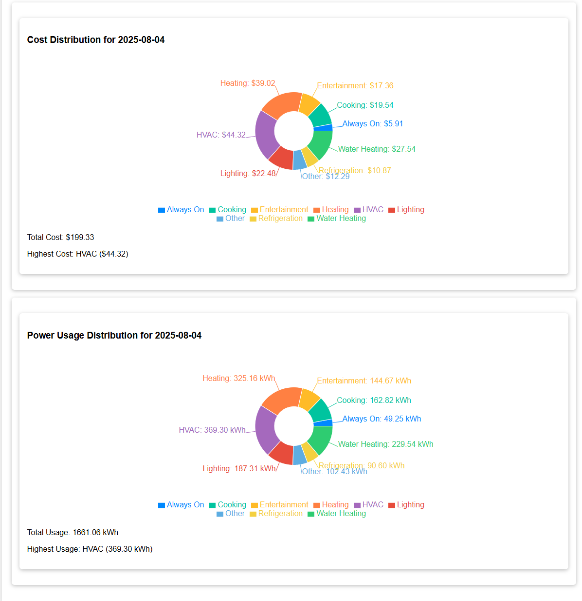

# Smart Home Energy Monitor (MongoDB Version) – v3.0

This project simulates a monthly smart home energy monitoring system using Python, Flask, and MongoDB Atlas. It provides a React front-end for visualizing energy usage, cost, interactive predictions, and breakdowns. The application uses scikit-learn for basic predictive analytics.

---

## Key Features

### Monthly Simulation
- **Advances Month-by-Month:** Each simulation run advances the month by one from the latest date in the database (or uses the current date if none exist).
- **Randomized Sensor Data:** Usage is randomized per sensor.
- **Realistic Cost Calculation:** Cost is calculated from usage at a realistic rate (e.g., $0.12/kWh).
- **Dedicated HVAC Sensor:** HVAC is added as a separate sensor category.

### Data Storage in MongoDB
- **Simplified Timestamps:** Readings are stored with a `simulation_date` (e.g., "2025-03-01") instead of full timestamps.
- **Monthly Aggregation:** Data is grouped and aggregated by month for simpler breakdowns and charts.

### Prediction Model
- **Linear Regression:** A Linear Regression model is trained on historical monthly totals (usage vs. month index).
- **Data Requirements:** If there is insufficient data (fewer than two months of history), the model remains untrained and predictions are unavailable.

### Flask API Endpoints
- **`POST /simulate`**: Generates and logs readings for the next month.
- **`GET /readings?month=YYYY-MM[-DD]`**: Fetches usage/cost data for a given month (or the latest if omitted). The endpoint accepts either a full date (`YYYY-MM-DD`) or a year-month (`YYYY-MM`) for filtering.
- **`DELETE /clear_readings`**: Clears all readings in the database.
- **`GET /history`**: Returns aggregated usage/cost for each simulated month (for charts).
- **`GET /predict?month=YYYY-MM-DD`**: Predicts monthly usage if enough data is available.
- **`GET /suggestions?usage=...`**: Provides energy-saving suggestions based on a usage value.

### React Front-End
- **Home:**  
  - Displays summary charts including:
    - **Bar Charts:** Show cost per month and power usage per month.
    - **Interactive Doughnut Charts:**  
      - **Cost Distribution Doughnut Chart:** Displays cost breakdown per category for the selected month.  
      - **Power Usage Distribution Doughnut Chart:** Displays power usage breakdown per category for the selected month.  
      - By default, these charts display data for the most recent month; clicking on a bar in the corresponding chart updates the respective doughnut chart.
    - 
    - 

- **Readings:**  
  - Shows data for the most recent (or selected) month and offers a **"Simulate Next Month"** button to generate new data.
  - Includes an inline **"Clear All Data"** button that triggers a warning modal before deleting all readings from the database.
  - 

- **Breakdown:**  
  - Displays usage/cost per category for a chosen month.
  - Accepts input in `YYYY-MM` format (year and month only) to filter data.
  - 

- **Predict:**  
  - Allows users to enter a future month (e.g., "2025-05-01") to view a usage forecast.

- **Suggestions:**  
  - Returns energy-saving tips based on current usage.

- **UI Enhancements:**  
  - Uses Cards, Modals, and Loading Spinners for a polished interface.
  - 
  - 
  - 
---

## Installation & Setup

### 1. Clone the Repository
Make sure you switch to the `version-3.0` branch:

```
git clone https://github.com/nnadede/ENGM4602Project_ND_Temi.git
cd smart_home_energy_monitor
git checkout version-3.0
```

### 2. Configure MongoDB Atlas
In SHEM/db_handler.py, update the URI with your MongoDB Atlas credentials. By default, the code uses:
```
uri="mongodb+srv://<USERNAME>:<PASSWORD>@cluster0.txypd.mongodb.net/?retryWrites=true&w=majority"
```
This stores data in the smart_home_energy_monitor database.

### 3. Install Python Dependencies
In the project root (where requirements.txt resides), run:
```
pip install -r requirements.txt
```

### 4. Run the Flask Backend
From the project root, start the Flask server:
```
python -m SHEM.flask_app
```
By default, it listens on http://127.0.0.1:5000.

### 5. Install and Run the React Front-End
Inside the react-frontend folder, run:
```
cd react-frontend
npm install
npm start
```
This starts a development server on http://localhost:3000.

## Usage
### Simulate Data
Simulate Next Month: Go to the Readings section in the React app and click Simulate Next Month.
This creates new sensor data for the next month and logs it in MongoDB.

### View Readings
- Latest Month’s Data: The Readings page displays the latest month’s usage and cost per category.
- Query Historical Data: You can query older months by entering a year and month (in YYYY-MM format) in the Breakdown page or via the GET /readings endpoint.

### Check Breakdown
- Usage/Cost Distribution: The Breakdown page displays the usage and cost distribution by category for a selected month.
Input requires only the year and month (e.g., "2025-05").
  
### Predict Future Usage
- Forecasting: In the Predict section, enter a future month (e.g., "2025-05-01").
If enough data (≥2 months) is available, the app returns a forecasted monthly usage.

### Suggestions
- Energy-Saving Tips: The Suggestions page accepts a numeric usage value and returns tips for reducing energy consumption.

### Clear Data
- Database Reset: The Readings page now includes an inline "Clear All Data" button.
When clicked, a warning modal is displayed. Upon confirmation, all readings are permanently deleted from the database.


## Notes & Future Extensions

### Single-User Focus
- Current Design: The system is designed for a single household or user.
- Future Enhancements: Future iterations can add user authentication and multi-user data segregation.

### Date Handling
- Month-to-Month Logic: This version uses simple logic to progress from one month to the next.
- Edge Cases: Real-world date edge cases (e.g., handling 31-day months) are handled minimally.

### Enhanced Predictive Modeling (Future Enhancements)
Improved Forecasting: Additional features (e.g., weather data, day-of-week patterns) could be integrated for more accurate predictions.

### Deployment (Future Enhancements)
Production Configuration: For production, configure environment variables for your MongoDB credentials.
Server Recommendations: Use a production server (e.g., gunicorn or uwsgi) with Flask.
